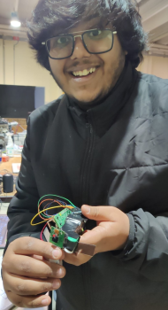

# AusCare-IoT-UniMoRe



[Presentation](AusCare_UniMoRe.pdf) || [Youtube](https://youtu.be/_-Oh0AxJfTw)

## Wiring connection of [the display (ST7735S Display)](https://jakew.me/st7735-pi/)

```
SCREEN PIN	RASPBERRY PI PIN
GND	Ground (pins 6, 9, 14, 20, 25, 30, 34 or 39)
VCC	5v Power (pins 2 or 4)
SCL	GPIO 11 (pin 23)
SDA	GPIO 10 (pin 19)
RES	GPIO 25 (pin 22)
DC	GPIO 24 (pin 18)
CS	GPIO 8 (pin 24)
BL	Not connected

$ pip3 install st7735
$ pinout
```

## Install the required packages for the flask application

```bash
$ pip install -r requirements.txt
```

## Run the application on localhost

```bash
$ python run.py
```

## Install [ngrok](https://ngrok.com/download) and add auth token

```bash
$ snap install ngrok # Linux Systems
$ brew install ngrok/ngrok/ngrok # Mac

$ ngrok config add-authtoken <token>
```

## Run the application using ngrok

```bash
$ python run-ngrok.py
```

## to test the emotion recognition script

```bash
$ python experiments/emotion-detector-deployed/emotion_detect.py
```
